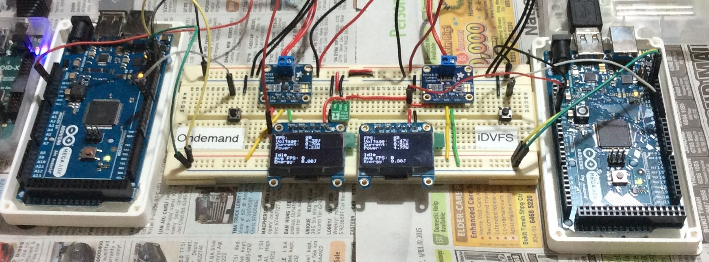
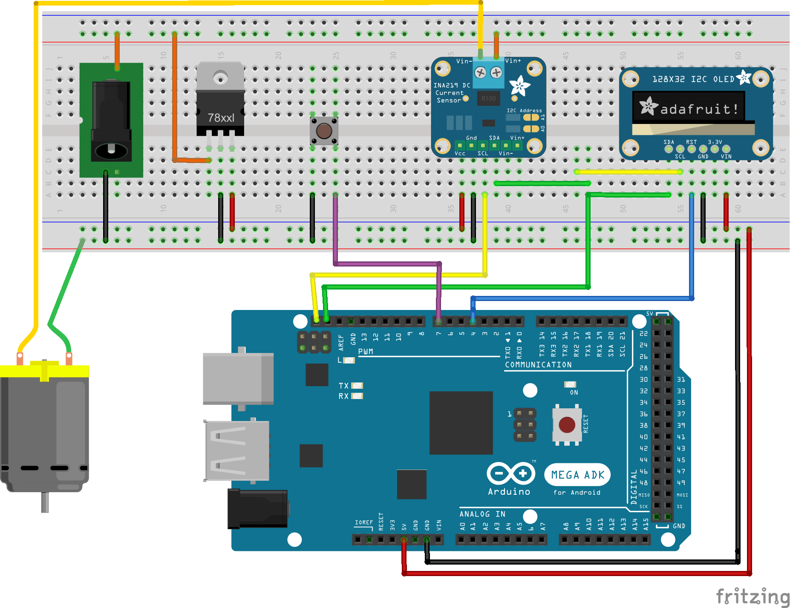

# fps-power-measure-tool
An Arduino setup to measure the frames per second (FPS) and power usage of a connected Android device. If you just want to measure the power usage, you can check out this [previous project](https://github.com/yeokm1/power_measure_tool) of mine. FPS data is obtained via ADB over the USB cable and power via a current sensor.

I created this tool for the purposes of my final year project (FYP) and I have open-sourced it in case anyone wishes to learn from this setup.

Picture of two sets as used in my final year project.

###Video of my usage in my FYP

###Schematic:

This logical schematic differs slightly from the physical curcuit layout. The motor here represents the phone. The barrel jack is the source supply power for both the motor and and the phone. The 78xxl represents any 5V voltage regulator you can use to supply 5V to the Arduino and the rest of the system in case your source voltage is very high.

##Parts List:
1. Arduino Mega ADK
2. Adafruit INA219 High Side DC Current Sensor Breakout
3. Adafruit 1.3" 128x64 OLED set to I2C
4. [Pololu 5V Step-Up/Step-Down Voltage Regulator S7V7F5](https://www.pololu.com/product/2119) (others will work fine)
5. Push Button

##References and libraries
1. [Smoothing algorithm](http://arduino.cc/en/Tutorial/Smoothing)
2. [Modified microbridge arduino](https://github.com/agoransson/microbridge-arduino)
3. [Standard C++ for Arduino](https://github.com/maniacbug/StandardCplusplus)
